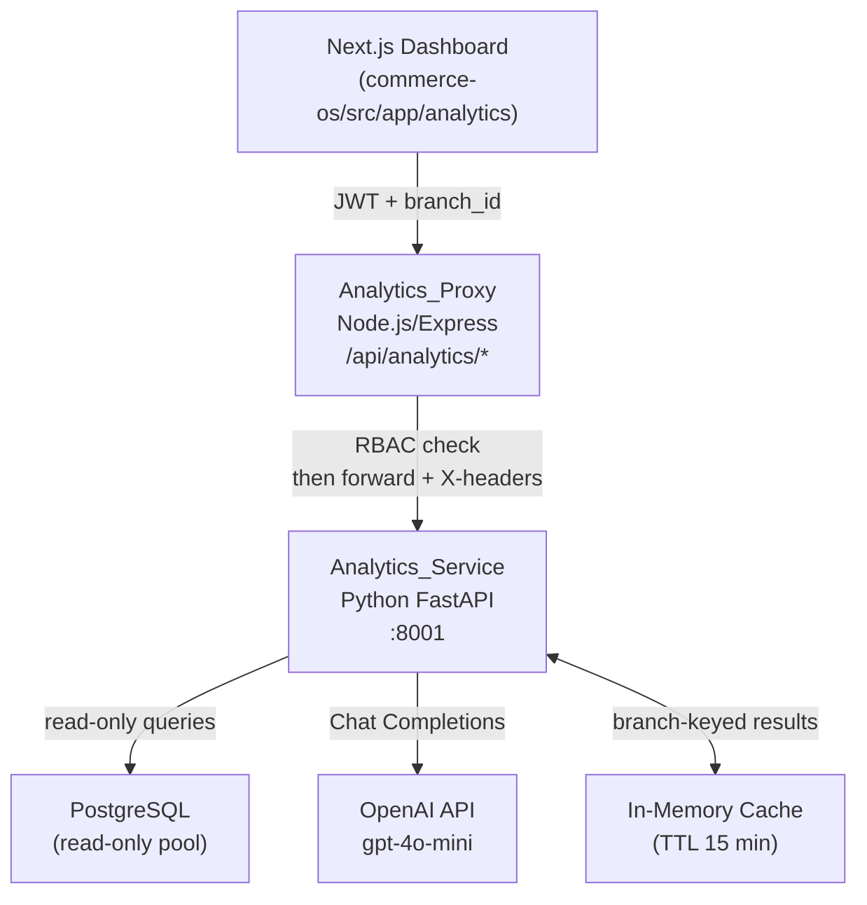

# Design Document: AI-Powered Analytics

## Overview

The AI-Powered Analytics feature introduces a Python FastAPI microservice (Analytics_Service) alongside an extended Node.js proxy layer (Analytics_Proxy) and a rebuilt Next.js dashboard (Analytics_Dashboard). The system delivers ML-driven sales forecasting, product demand prediction, customer segmentation, best-seller rankings, restock recommendations, and a natural-language query interface — all scoped to `branch_id` and gated by the `reports:read` RBAC permission.

The design follows a sidecar microservice pattern: the existing Node.js/Express backend gains a thin proxy module at `/api/analytics/` that validates JWT tokens and RBAC permissions, then forwards requests to the Analytics_Service over an internal HTTP connection. The Analytics_Service owns all ML inference and OpenAI API calls; it never writes to the database and never accepts direct browser connections.

Key design decisions:
- **Python for ML**: Prophet/ARIMA and the OpenAI SDK are mature Python libraries; isolating them in a FastAPI service avoids polluting the Node.js runtime.
- **On-demand extraction with in-memory cache**: Avoids a separate ETL scheduler while keeping DB load low (15-minute TTL per branch).
- **Header-based context propagation**: The proxy attaches `X-Business-ID`, `X-Branch-ID`, and `X-User-Role` so the Analytics_Service can scope queries without re-validating JWTs.
- **Recharts for frontend**: Already available in the Next.js ecosystem; no additional charting library needed.

---

## Architecture



### Service Boundaries

| Component | Runtime | Port | Responsibility |
|---|---|---|---|
| Analytics_Proxy | Node.js/Express | 4000 (existing) | Auth, RBAC, request forwarding, response envelope |
| Analytics_Service | Python FastAPI | 8001 | ML inference, OpenAI calls, data extraction |
| Analytics_Dashboard | Next.js (browser) | 3000 (existing) | Charts, insights, NL query UI |

### Request Flow

1. Browser sends `GET /api/analytics/forecast/sales?branch_id=X&horizon_days=7` with `Authorization: Bearer <jwt>`.
2. Analytics_Proxy validates JWT via existing `authMiddleware`, checks `reports:read` via RBAC middleware.
3. If `branch_id = 'all'` and role is not `owner`, proxy returns 403.
4. Proxy forwards to `http://localhost:8001/analytics/forecast/sales` with headers `X-Business-ID`, `X-Branch-ID`, `X-User-Role`.
5. Analytics_Service checks cache; on miss, queries PostgreSQL read-only pool.
6. Analytics_Service runs Forecasting_Model, calls OpenAI for insight, returns JSON.
7. Proxy wraps response in `{ data, error, meta }` envelope and returns to browser.

---

## Components and Interfaces

### Analytics_Proxy (Node.js)

Replaces the existing `analytics.routes.js` with a new module at `backend/src/modules/analytics/analytics.proxy.js`.

```javascript
// Route registration in index.js
app.use('/api/analytics', require('./modules/analytics/analytics.proxy'));
```

Middleware stack per route:
1. `authMiddleware` — validates JWT, attaches `req.user`
2. `requirePermission('reports:read')` — RBAC check from RBAC spec middleware
3. `branchScopeGuard` — rejects `branch_id=all` for non-owner roles
4. `forwardToService` — proxies to Analytics_Service with context headers

```javascript
// Context headers attached on every forwarded request
'X-Business-ID': req.user.businessId,
'X-Branch-ID':   req.query.branch_id || req.body.branch_id,
'X-User-Role':   req.user.role,
```

Error handling: if Analytics_Service returns non-2xx or connection fails, proxy returns `{ data: null, error: { code, message }, meta: { generated_at } }` with appropriate HTTP status.

### Analytics_Service (Python FastAPI)

Entry point: `analytics_service/main.py`

```
analytics_service/
  main.py              # FastAPI app, CORS config, router registration
  routers/
    forecast.py        # /analytics/forecast/sales, /analytics/forecast/demand
    customers.py       # /analytics/customers/segmentation
    recommendations.py # /analytics/recommendations/best-sellers, /analytics/recommendations/restock
    query.py           # /analytics/query
  services/
    data_pipeline.py   # PostgreSQL extraction + cache
    forecasting.py     # Prophet/ARIMA wrapper
    demand.py          # Per-product demand model
    segmentation.py    # New vs repeat classification
    openai_client.py   # OpenAI Chat Completions wrapper
  models/
    schemas.py         # Pydantic request/response models
  db.py                # Read-only asyncpg connection pool
  cache.py             # In-memory TTL cache (cachetools or dict + timestamp)
  config.py            # Settings from environment variables
```

**Health endpoint**: `GET /health` returns `{ status: "ok", models: { forecasting: bool, demand: bool } }`.

**CORS**: Only allows requests from the proxy's origin (configurable via `PROXY_ORIGIN` env var). Direct browser access is rejected.

### Data Pipeline (`services/data_pipeline.py`)

Responsible for extracting and caching data from PostgreSQL. All queries are parameterized and scoped to `branch_id` (or all branches for `branch_id='all'`).

Key extraction functions:

```python
async def get_daily_sales(branch_id: str, business_id: str) -> pd.DataFrame:
    # SELECT date_trunc('day', created_at), SUM(amount)
    # FROM transactions WHERE branch_id=? AND status='success'
    # GROUP BY 1 ORDER BY 1

async def get_product_sales(branch_id: str, business_id: str) -> pd.DataFrame:
    # SELECT product_id, product_name, SUM(quantity_delta) as qty_sold
    # FROM stock_logs WHERE branch_id=? AND action_type='SALE'
    # GROUP BY 1, 2

async def get_customer_transactions(branch_id: str, business_id: str) -> pd.DataFrame:
    # SELECT customer_id, COUNT(*) as tx_count
    # FROM transactions WHERE branch_id=? AND status='success'
    # GROUP BY 1
```

Cache key: `f"{business_id}:{branch_id}:{data_type}"`. TTL: 15 minutes (configurable via `CACHE_TTL_SECONDS`).

Data quality check: if `get_daily_sales` returns fewer than 30 rows, the pipeline sets `data_quality_warning = "Insufficient historical data (< 30 days)"`.

### Forecasting Service (`services/forecasting.py`)

Wraps Facebook Prophet (primary) with ARIMA fallback if Prophet fails to fit.

```python
def forecast_sales(daily_df: pd.DataFrame, horizon_days: int) -> ForecastResult:
    # Fits Prophet on ds/y columns
    # Returns list of { date, predicted_revenue, confidence_interval: { lower, upper } }
```

Prophet is chosen over ARIMA as the default because it handles seasonality and missing data more gracefully for retail time series. ARIMA is used as fallback for very short series (< 30 points).

### Demand Service (`services/demand.py`)

Per-product forecasting using a simple linear trend + seasonal decomposition (Prophet per product, or moving average for products with < 14 days of history).

```python
def forecast_demand(product_df: pd.DataFrame, horizon_days: int) -> list[DemandForecast]:
    # Returns list sorted by predicted_quantity DESC
    # Adds data_quality_warning per product if < 14 days history
```

### Segmentation Service (`services/segmentation.py`)

Classifies customers based on transaction count within the business (not branch-scoped for classification, but counts are branch-scoped).

```python
def segment_customers(tx_df: pd.DataFrame, date_range: DateRange) -> SegmentationResult:
    # new = customer_id with tx_count == 1 in business
    # repeat = customer_id with tx_count > 1 in business
    # Returns summary + weekly time-series
```

### OpenAI Client (`services/openai_client.py`)

Wraps the OpenAI Python SDK. Uses `gpt-4o-mini` by default (configurable via `OPENAI_MODEL` env var). Timeout: 10 seconds.

```python
async def generate_insight(context: dict, prompt_template: str) -> str:
    # Constructs prompt from template + sanitized context data
    # Returns insight string or raises OpenAIError on failure

async def answer_nl_query(question: str, data_summary: dict) -> NLQueryResponse:
    # Sanitizes question (strip HTML, truncate to 500 chars)
    # Returns { answer, chart_data, query_interpreted }
```

Prompt injection mitigation: HTML tags stripped from `question` using `bleach.clean()`, then truncated to 500 characters before inclusion in the prompt.

### Analytics_Dashboard (Next.js)

Extended from `src/app/analytics/page.tsx`. Restructured into section components:

```
src/app/analytics/
  page.tsx                    # Route guard + layout
  components/
    SalesForecastSection.tsx
    DemandSection.tsx
    SegmentationSection.tsx
    BestSellersSection.tsx
    RestockSection.tsx
    NLQuerySection.tsx
    DataQualityNotice.tsx
    LoadingSkeleton.tsx
```

Route guard: checks `reports:read` permission from auth context; redirects to `/dashboard` if absent.

Branch context: reads active `branch_id` from the branch switcher context (multi-branch-support spec). Re-fetches all sections on branch change.

Cross-branch toggle: shown only for `owner` role; switches `branch_id` parameter to `'all'`.

---

## Data Models

### Pydantic Schemas (Analytics_Service)

```python
class ForecastPoint(BaseModel):
    date: str                    # ISO 8601
    predicted_revenue: float
    confidence_interval: ConfidenceInterval

class ConfidenceInterval(BaseModel):
    lower: float
    upper: float

class SalesForecastResponse(BaseModel):
    forecast: list[ForecastPoint]
    insight: str
    data_quality_warning: str | None
    generated_at: str            # ISO 8601

class DemandForecast(BaseModel):
    product_id: str
    product_name: str
    predicted_quantity: float
    confidence_interval: ConfidenceInterval
    data_quality_warning: str | None

class DemandResponse(BaseModel):
    forecasts: list[DemandForecast]   # sorted by predicted_quantity DESC
    insight: str
    generated_at: str

class SegmentationSummary(BaseModel):
    total_customers: int
    new_customers: CustomerSegment
    repeat_customers: CustomerSegment
    repeat_purchase_rate: float
    weekly_breakdown: list[WeeklySegment]
    insight: str
    generated_at: str

class CustomerSegment(BaseModel):
    count: int
    percentage: float

class WeeklySegment(BaseModel):
    week_start: str
    new_count: int
    repeat_count: int

class BestSellerItem(BaseModel):
    rank: int
    product_id: str
    product_name: str
    total_quantity_sold: int
    total_revenue: float

class BestSellersResponse(BaseModel):
    items: list[BestSellerItem]
    insight: str
    generated_at: str

class RestockItem(BaseModel):
    product_id: str
    product_name: str
    current_stock: int
    reorder_level: int
    predicted_demand: float
    suggested_restock_quantity: int
    urgency: Literal['critical', 'high', 'medium']

class RestockResponse(BaseModel):
    items: list[RestockItem]     # sorted: critical > high > medium, then predicted_demand DESC
    insight: str
    generated_at: str

class NLQueryRequest(BaseModel):
    question: str = Field(max_length=500)
    branch_id: str

class NLQueryResponse(BaseModel):
    answer: str
    chart_data: dict | None
    query_interpreted: str
    generated_at: str
```

### Analytics_Proxy Response Envelope (Node.js)

All proxy responses conform to the existing module convention:

```json
{
  "data": { ... },
  "error": null,
  "meta": {
    "generated_at": "2024-01-15T10:30:00Z",
    "page": 1,
    "limit": 10,
    "total": 42
  }
}
```

### Database Tables Referenced (read-only)

| Table | Key Columns Used | Source Spec |
|---|---|---|
| `transactions` | `branch_id`, `business_id`, `amount`, `status`, `created_at`, `order_id` | payment-gateway-integration |
| `products` | `product_id`, `name`, `stock_quantity`, `reorder_level`, `branch_id` | inventory-management |
| `stock_logs` | `product_id`, `branch_id`, `action_type`, `quantity_delta`, `created_at` | inventory-management |
| `branches` | `branch_id`, `business_id` | multi-branch-support |
| `customers` | `id`, `business_id` | existing schema_v2 |

Note: The Analytics_Service uses a separate read-only PostgreSQL connection pool (`READ_ONLY_DATABASE_URL` env var pointing to the same DB with a read-only role) to enforce the no-write constraint at the database level.

---

## Correctness Properties

*A property is a characteristic or behavior that should hold true across all valid executions of a system — essentially, a formal statement about what the system should do. Properties serve as the bridge between human-readable specifications and machine-verifiable correctness guarantees.*

### Property 1: Context Headers Attached on Every Forwarded Request

*For any* authenticated request that passes RBAC validation, the Analytics_Proxy must attach `X-Business-ID`, `X-Branch-ID`, and `X-User-Role` headers to the forwarded request sent to the Analytics_Service.

**Validates: Requirements 1.4, 11.4**

---

### Property 2: Only Successful Transactions Included in Sales Data

*For any* dataset extracted by the Data_Pipeline, all transaction records included must have `status = 'success'`; records with any other status must be excluded.

**Validates: Requirements 2.1**

---

### Property 3: Daily Sales Aggregation Correctness

*For any* set of successful transaction records for a given `branch_id`, the daily aggregated totals produced by the Data_Pipeline must equal the sum of `amount` values grouped by `date_trunc('day', created_at)` for that branch.

**Validates: Requirements 2.2**

---

### Property 4: Only SALE Stock_Logs Included in Product Sales Data

*For any* dataset extracted by the Data_Pipeline for product demand, all stock_log records included must have `action_type = 'SALE'`; records with other action types (RESTOCK, ADJUSTMENT, BULK_UPLOAD) must be excluded.

**Validates: Requirements 2.3, 4.2**

---

### Property 5: Branch Scoping on All Data Queries

*For any* analytics request with a specific `branch_id`, all data returned by the Analytics_Service must contain only records whose `branch_id` matches the requested branch; records from other branches must never appear in the response.

**Validates: Requirements 2.5**

---

### Property 6: Cache Returns Consistent Results Within TTL Window

*For any* pair of identical analytics requests made within the 15-minute TTL window, the second request must return the same data payload as the first (served from cache), without issuing a new database query.

**Validates: Requirements 2.6**

---

### Property 7: Data Quality Warning on Insufficient History

*For any* analytics request where the extracted dataset contains fewer than 30 days of transaction records for the given `branch_id`, the response must include a non-null `data_quality_warning` field. Conversely, if 30 or more days of data are present, `data_quality_warning` must be null.

**Validates: Requirements 2.7, 3.6**

---

### Property 8: Forecast Response Schema and Confidence Interval Invariant

*For any* sales forecast response, every element in the `forecast` array must contain `date` (valid ISO 8601 string), `predicted_revenue` (non-negative number), and a `confidence_interval` with `lower` and `upper` bounds where `lower <= predicted_revenue <= upper`.

**Validates: Requirements 3.3, 3.4**

---

### Property 9: All Analytics Responses Include Non-Empty Insight

*For any* analytics response from the forecast, demand, segmentation, best-sellers, or restock endpoints, the `insight` field must be a non-empty string.

**Validates: Requirements 3.5, 4.5, 5.5, 6.4, 7.5**

---

### Property 10: Demand Response Schema and Descending Order

*For any* demand prediction response, every element in the `forecasts` array must contain `product_id`, `product_name`, `predicted_quantity` (non-negative), and `confidence_interval`. The list must be sorted by `predicted_quantity` in descending order.

**Validates: Requirements 4.3, 4.4**

---

### Property 11: Per-Product Data Quality Warning for Short History

*For any* demand prediction response, every product entry whose underlying sales history contains fewer than 14 days of data must have a non-null `data_quality_warning` field in its forecast entry.

**Validates: Requirements 4.6**

---

### Property 12: Segmentation Math Invariants and Weekly Breakdown Consistency

*For any* segmentation response, the following must hold: `new_customers.count + repeat_customers.count == total_customers`, `new_customers.percentage + repeat_customers.percentage ≈ 100.0` (within floating-point tolerance), `repeat_purchase_rate == repeat_customers.count / total_customers`, and the sum of `new_count + repeat_count` across all weekly breakdown entries must equal `total_customers`.

**Validates: Requirements 5.3, 5.4**

---

### Property 13: Customer Classification Correctness

*For any* set of transaction records, a customer must be classified as `new` if and only if they have exactly one transaction within the business; a customer must be classified as `repeat` if and only if they have more than one transaction within the business.

**Validates: Requirements 5.2**

---

### Property 14: Best-Sellers Schema, Ordering, and SALE-Only Source

*For any* best-sellers response, every item must contain `rank`, `product_id`, `product_name`, `total_quantity_sold` (non-negative integer), and `total_revenue` (non-negative number). The list must be sorted by `total_quantity_sold` descending, and `total_quantity_sold` must be derived exclusively from stock_log records with `action_type = 'SALE'`.

**Validates: Requirements 6.2, 6.3**

---

### Property 15: Restock Schema, Urgency Assignment, and Sort Order

*For any* restock response, every item must contain all required fields. The `urgency` field must be assigned as: `critical` if `current_stock == 0`, `high` if `current_stock < reorder_level` (and not critical), `medium` otherwise. The list must be sorted with `critical` items first, then `high`, then `medium`, and within each tier sorted by `predicted_demand` descending.

**Validates: Requirements 7.3, 7.4**

---

### Property 16: Restock Inclusion Criterion

*For any* product in the inventory, it must appear in the restock list if and only if `stock_quantity < reorder_level` OR `stock_quantity < predicted_quantity` for the given `horizon_days`.

**Validates: Requirements 7.2**

---

### Property 17: NL Query Input Sanitization

*For any* question string submitted to the NL query endpoint, the string passed to the OpenAI_Client must contain no HTML tags and must have length ≤ 500 characters, regardless of the original input length or HTML content.

**Validates: Requirements 8.7**

---

### Property 18: NL Query Response Schema

*For any* successful NL query response, the JSON object must contain `answer` (non-empty string), `query_interpreted` (non-empty string), and `generated_at` (valid ISO 8601). The `chart_data` field may be null or a structured object.

**Validates: Requirements 8.4**

---

### Property 19: Cross-Branch Access Requires Owner Role

*For any* analytics request with `branch_id = 'all'`, the Analytics_Proxy must return HTTP 403 if the authenticated user's role is not `owner`, before forwarding the request to the Analytics_Service.

**Validates: Requirements 10.2**

---

### Property 20: Cross-Branch Response Includes Per-Branch Breakdowns

*For any* analytics response when `branch_id = 'all'` is requested by an owner, the response must include both aggregated totals and a per-branch breakdown array containing one entry per branch belonging to the business.

**Validates: Requirements 10.1, 10.3**

---

### Property 21: RBAC Enforcement — 403 Without reports:read

*For any* request to any `/api/analytics/` route made by an authenticated user who does not hold the `reports:read` permission, the response must be HTTP 403.

**Validates: Requirements 11.1, 11.2**

---

### Property 22: Auth Enforcement — 401 Without Valid JWT

*For any* request to any `/api/analytics/` route made without a valid JWT access token, the response must be HTTP 401.

**Validates: Requirements 11.3**

---

### Property 23: Branch-to-Business Validation

*For any* request to the Analytics_Service where the `branch_id` does not belong to the `business_id` provided in the `X-Business-ID` header, the response must be HTTP 403.

**Validates: Requirements 11.5**

---

### Property 24: Response Envelope Invariant

*For any* response from the Analytics_Proxy, the JSON body must conform to `{ data, error, meta }` structure where `meta.generated_at` is a valid ISO 8601 timestamp.

**Validates: Requirements 12.2, 12.5**

---

### Property 25: Pagination Limit Enforcement

*For any* paginated list request to the Analytics_Proxy, if the requested `limit` exceeds 100, the response must cap the returned records at 100 and reflect the actual limit in the `meta` field.

**Validates: Requirements 12.3**

---

### Property 26: HTTP 400 on Missing or Invalid Required Parameters

*For any* request to the Analytics_Service that omits a required parameter (`branch_id`, `horizon_days`) or provides an invalid value (e.g., `horizon_days` not in {7, 30}), the response must be HTTP 400 with a descriptive error message.

**Validates: Requirements 12.4**

---

## Error Handling

### Analytics_Proxy Error Handling

| Condition | HTTP Status | Response |
|---|---|---|
| Missing/invalid JWT | 401 | `{ data: null, error: { code: "UNAUTHORIZED", message: "..." }, meta: { generated_at } }` |
| Missing `reports:read` permission | 403 | `{ data: null, error: { code: "FORBIDDEN", message: "..." }, meta: { generated_at } }` |
| `branch_id=all` for non-owner | 403 | `{ data: null, error: { code: "FORBIDDEN", message: "Cross-branch access requires owner role" }, meta: { generated_at } }` |
| Analytics_Service unavailable | 503 | `{ data: null, error: { code: "SERVICE_UNAVAILABLE", message: "Analytics service is temporarily unavailable" }, meta: { generated_at } }` |
| Analytics_Service timeout (>15s) | 503 | Same as above |
| Analytics_Service returns 4xx | Pass-through | Proxy forwards status and wraps body in envelope |

### Analytics_Service Error Handling

| Condition | HTTP Status | Behavior |
|---|---|---|
| Missing required query param | 400 | FastAPI validation error with field details |
| Invalid `horizon_days` value | 400 | Descriptive message: "horizon_days must be 7 or 30" |
| `branch_id` not in business | 403 | `{ detail: "Branch does not belong to this business" }` |
| OpenAI API failure/timeout | 503 | `{ detail: "AI service temporarily unavailable" }` — no partial answer returned |
| DB connection failure | 503 | `{ detail: "Data source temporarily unavailable" }` |
| Forecasting model fit failure | 200 with warning | Falls back to ARIMA; if both fail, returns `data_quality_warning` with empty forecast array |

### Frontend Error Handling

Each dashboard section independently handles its own error state:
- On API error: display descriptive error message with a retry button
- On loading: display `LoadingSkeleton` component
- On `data_quality_warning`: display `DataQualityNotice` inline within the affected section
- On 401: redirect to login page
- On 403: redirect to `/dashboard` with a toast notification

---

## Testing Strategy

### Dual Testing Approach

Both unit tests and property-based tests are required. Unit tests verify specific examples, integration points, and error conditions. Property-based tests verify universal correctness across randomized inputs.

### Unit Tests

**Analytics_Service (Python — pytest)**:
- Health endpoint returns 200 with correct schema
- CORS rejects requests without proxy origin header
- `GET /analytics/forecast/sales` returns correct response shape for a known dataset
- `GET /analytics/forecast/demand` returns correct response shape
- `GET /analytics/customers/segmentation` returns correct response shape
- `GET /analytics/recommendations/best-sellers` returns correct response shape
- `GET /analytics/recommendations/restock` returns correct response shape
- `POST /analytics/query` returns 503 when OpenAI is mocked to fail
- `POST /analytics/query` returns 503 when OpenAI times out after 10 seconds
- Missing `branch_id` returns 400
- Invalid `horizon_days` returns 400
- `branch_id` not in business returns 403
- All 7 proxy endpoints exist and respond

**Analytics_Proxy (Node.js — Jest)**:
- Request without JWT returns 401
- Request without `reports:read` returns 403
- `branch_id=all` with non-owner role returns 403
- Analytics_Service unavailable returns 503
- Valid request forwards with correct X-headers
- Response is wrapped in `{ data, error, meta }` envelope

**Analytics_Dashboard (React — Vitest + React Testing Library)**:
- Unauthenticated user is redirected from `/analytics`
- User without `reports:read` is redirected to home
- All 6 sections render with loading skeletons initially
- `data_quality_warning` renders as inline notice
- Branch context change triggers re-fetch
- Owner role shows cross-branch toggle

### Property-Based Tests

**Library**: `hypothesis` (Python) for Analytics_Service; `fast-check` (TypeScript) for Analytics_Proxy and Dashboard.

**Minimum iterations**: 100 per property test.

**Tag format**: `# Feature: ai-analytics, Property N: <property_text>`

| Property | Test Description | Library |
|---|---|---|
| P1 | For any valid request, forwarded call contains all 3 X-headers | fast-check |
| P2 | For any transaction dataset, only status='success' records appear in extracted data | hypothesis |
| P3 | For any transaction set, daily aggregation equals manual sum per day | hypothesis |
| P4 | For any stock_log dataset, only action_type='SALE' records appear in product sales data | hypothesis |
| P5 | For any request with branch_id X, all returned records have branch_id = X | hypothesis |
| P6 | For any two identical requests within TTL, second response matches first | hypothesis |
| P7 | For any dataset with < 30 days, response has non-null data_quality_warning; >= 30 days, null | hypothesis |
| P8 | For any forecast response, all points have valid schema and lower <= predicted_revenue <= upper | hypothesis |
| P9 | For any analytics response (forecast/demand/segmentation/best-sellers/restock), insight is non-empty string | hypothesis |
| P10 | For any demand response, all items have required fields and list is sorted by predicted_quantity DESC | hypothesis |
| P11 | For any product with < 14 days history, its demand entry has non-null data_quality_warning | hypothesis |
| P12 | For any segmentation response, new + repeat = total, percentages sum to 100, weekly sums match total | hypothesis |
| P13 | For any transaction set, customers with count=1 are 'new', count>1 are 'repeat' | hypothesis |
| P14 | For any best-sellers response, items have required fields, sorted by qty DESC, only SALE records used | hypothesis |
| P15 | For any restock response, urgency assignment is correct and sort order is critical > high > medium > predicted_demand DESC | hypothesis |
| P16 | For any product set, restock list contains exactly products where stock < reorder_level OR stock < predicted_demand | hypothesis |
| P17 | For any question string (including HTML, long strings), sanitized version has no HTML tags and length <= 500 | hypothesis |
| P18 | For any successful NL query response, answer and query_interpreted are non-empty, generated_at is valid ISO 8601 | hypothesis |
| P19 | For any request with branch_id='all' and non-owner role, proxy returns 403 | fast-check |
| P20 | For any owner cross-branch response, per-branch breakdown count equals number of branches in business | hypothesis |
| P21 | For any request to /api/analytics/* without reports:read, response is 403 | fast-check |
| P22 | For any request to /api/analytics/* without valid JWT, response is 401 | fast-check |
| P23 | For any request where branch_id is not in business, Analytics_Service returns 403 | hypothesis |
| P24 | For any proxy response, body conforms to {data, error, meta} with valid ISO 8601 generated_at | fast-check |
| P25 | For any paginated request with limit > 100, returned record count is <= 100 | fast-check |
| P26 | For any request missing required params or with invalid horizon_days, response is 400 | hypothesis |

### Test Configuration

```python
# Python property tests (hypothesis)
# Feature: ai-analytics, Property 2: Only successful transactions included
@given(transactions=st.lists(transaction_strategy(), min_size=0, max_size=200))
@settings(max_examples=100)
def test_only_success_transactions_included(transactions):
    ...
```

```typescript
// TypeScript property tests (fast-check)
// Feature: ai-analytics, Property 1: Context headers attached on every forwarded request
it('attaches context headers on every forwarded request', () => {
  fc.assert(fc.property(validRequestArbitrary, (req) => {
    ...
  }), { numRuns: 100 });
});
```
